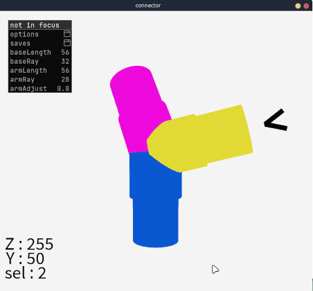

# connector
A stl shape maker to connect tube with Processing

## General info
With Connector you can create connection between plastic tubes for 3D printing [like this](https://matheplica.github.io/3D.html)

## Screenshots

## Setup
Install LazyGui library via contribute manager
download code and run Processing

## Where to start

Press n to create a new arm

Press arrow key to move it

Use gui to change parameter as you need

Press b to add a center ball

Press w - x to change selected arm

Press mouse and move to turn around shape

Press r to reload mouse position

Press d to delete arm

Press s to save as stl files
